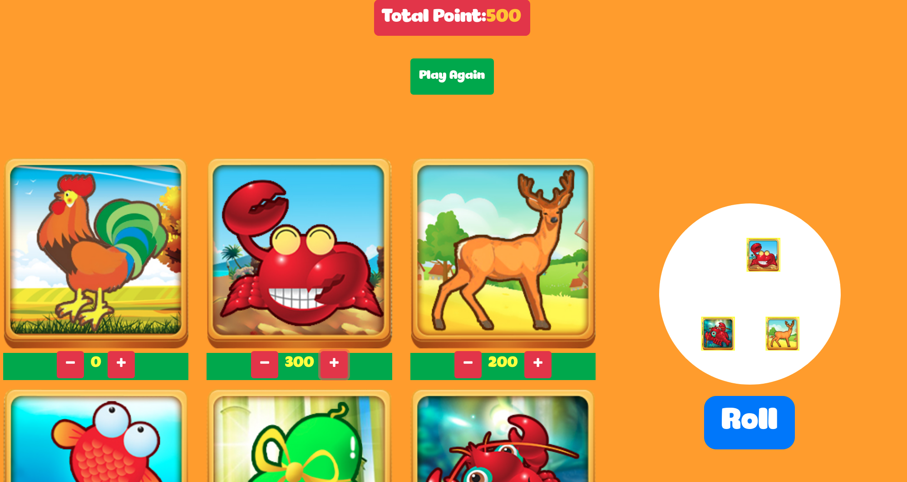

# Getting Started with Create React App

This project was bootstrapped with [Create React App](https://github.com/facebook/create-react-app).

## Project Description

This is a Vietnamese popular game during New Year Tet Festival. Player will be given 1000 point and 6 game choices to bet. Then when player clicks roll, the dices will start rotating to give out 3 dices randomly. If game choices that player picked matched with the random dices, the total point will increase matched with the point the player bet on that game choice and also return the point that the player

## Available Scripts

In the project directory, you can run:

### `yarn start`

Runs the app in the development mode.\
Open [http://localhost:3000](http://localhost:3000) to view it in the browser.

The page will reload if you make edits.\
You will also see any lint errors in the console.

## Project view

